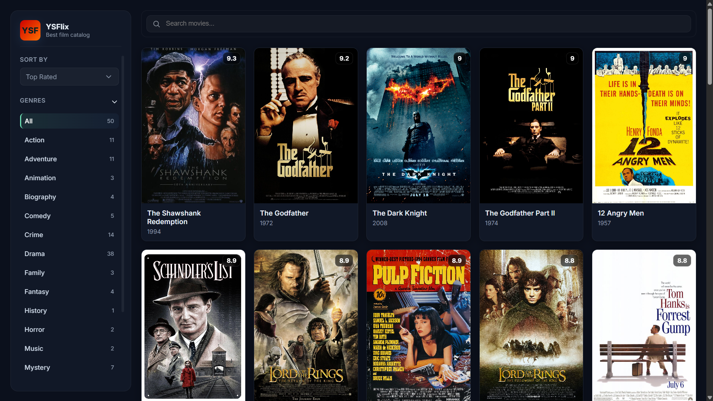
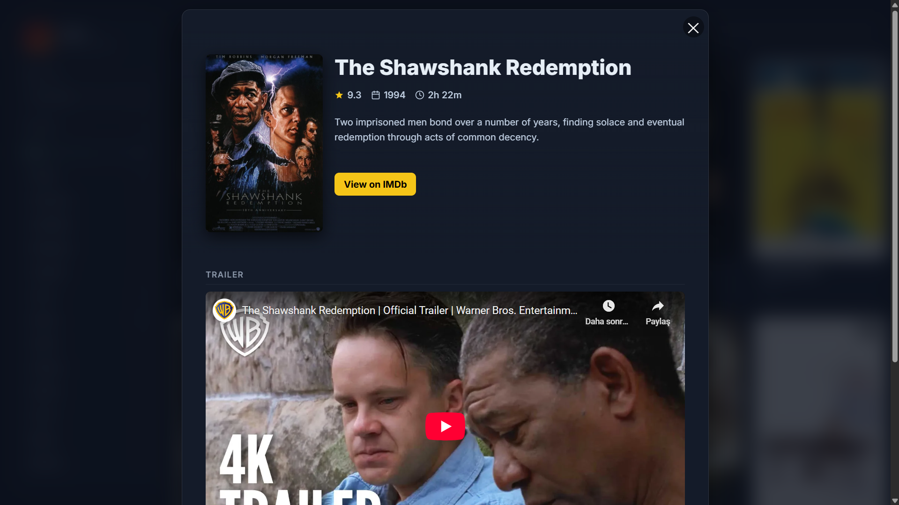

# YSFlix - Modern Movie Catalog

YSFlix is a modern and responsive single-page movie catalog application built using vanilla HTML, CSS, and JavaScript. It allows users to browse top-rated movies, search, filter by genre, and view movie details.

## ✨ Features

- **Dynamic Movie Listing:** Movie data is dynamically rendered on the screen using JavaScript.
- **Filter by Genre:** Movies can be filtered by desired genre from the sidebar.
- **Advanced Sorting:** Movies can be sorted by rating (high to low) and year (newest to oldest / oldest to newest).
- **Instant Search:** Instant search capability by title, description, or cast.
- **Details Window (Modal):** When you click on a movie card, a modern modal opens showing detailed information about the movie (trailer, director, cast, etc.).
- **Responsive Design:** Fully compatible with mobile, tablet, and desktop devices.

## 🛠️ Technologies Used

- **HTML5**
- **CSS3** (Flexbox, Grid, Custom Properties, Transitions, Keyframes)
- **JavaScript** (ES6 Modules, DOM Manipulation)

Translated with DeepL.com (free version)
